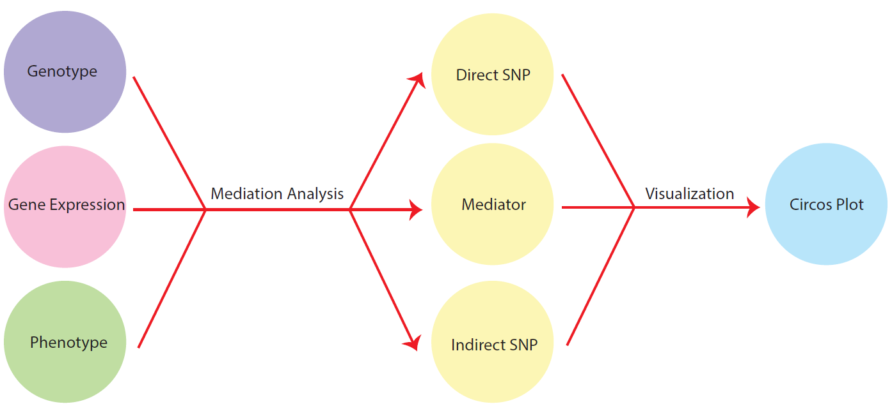
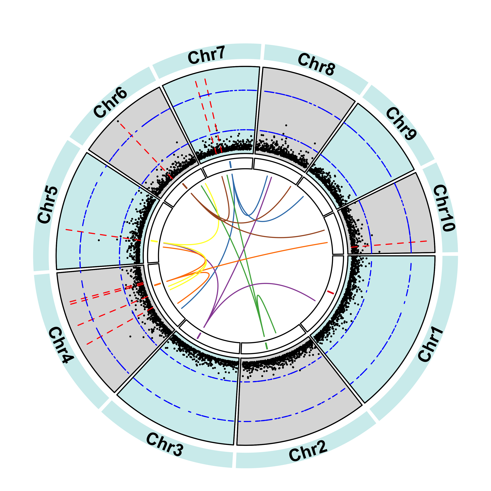

[](http://www.gnu.org/licenses/gpl-3.0)


## Overview of mediation analysis Workflow



## Installation

- __Running environment__: 
    - The workflow was constructed based on the __Linux system__ running the R v3.5.

- __Required software and versions__: 
    - [R 3.5](https://cran.r-project.org/)
        - /workflow/1_mediation_demo.R 
        - /lib/fromSKAT.R, highmed2019.r, MedWrapper.R, reporters.R, slurm_wrapper.R

## Input Data

The example data used here are simulated files.  

- `input/Z_matrix.txt` : Genotype (bi-allele SNP data, coded as -1, 0, 1, with each column represents each SNP, and each row represents each line)
- `input/X0_matrix.txt` : Confounder (Principal components of Z matrix, with each column represents each principal component, and each row represents each line)
- `input/X_matrix.txt` : Gene Expression (each column represents each gene expression, and each row represents each line)
- `input/y_matrix.txt` : Phenotype (each column represents each trait, and each row represents each line)


## Major steps

#### Step 1: running the 1_mediation_demo.R to conduct mediation analysis
- Note that you have to adjust the path at the begining in R script; and the path, ntasks, mem, time in the shell script.

```
sbatch workflow/1_mediation_demo.sh
```

#### Step 2: Visualization of outputs
- You can plot the results yourself using the below R code.
- Note that you have to adjust the path at the begining in R script;

```
2_circos_visual.R
```


## Expected results

The outputs of the example data:  

- `output/res_fixed_bic_trait_V1.csv, res_fixed_eq_trait_V1.csv, res_mixed_linear_trait_V1.csv, res_mixed_shrink_trait_V1.csv` : summaries of the results for different methods of mediation: MedFix_BIC, MedFix_0.5, MedMixed_Linear, MedMixed_Shrink (pmed.pure: proportion of the variance mediated, v.tot: variance of total effect, v.med: variance of indirect effect, v.dir: variance of direct effect, n.med: number of significant mediators after adjustment to control the false discovery proportion (FDP) in mediator selection, pval.cut: the threshold for deciding significance, n.direct: number of direct snps.)
- `output/mediators_fixed_bic_trait_V1.csv, mediators_fixed_eq_trait_V1.csv, mediators_mix_linear_trait_V1.csv, mediators_mix_shrink_trait_V1.csv` : non-adjusted mediators of different methods of mediation: MedFix_BIC, MedFix_0.5, MedMixed_Linear, MedMixed_Shrink (id: mediator gene id, e2m: p-value of effect from exposure to mediator, m2y: p-value of effect from mediator to outcome, e2m2y: maximum value between e2m and m2y, padj: adjusted p-value, coef: product of effect from exposure to mediator and effect from mediator to outcome? )
- `output/dsnps_fixed_bic_trait_V1.csv` : direct SNPs identified (only MedFix methods will report direct SNPs, but here only MedFix_BIC identify direct SNPs; snp: direct SNP, pval: p-value of effect from exposure to outcome, coef: effect of from exposure to outcome)
- `output/isnps_fixed_bic_trait_V1.csv, isnps_fixed_eq_trait_V1.csv` : indirect SNPs identified (only MedFix methods will report direct SNPs; medi: mediator gene, snps_for_medi: indirect SNPs for the corresponding mediator, coef: effect from exposure to mediator)


Visualization of outputs of MedFix_BIC and GWAS:



- In the circos plots, the outermost circular track represents the ten maize chromosomes; the next inner track shows the GWAS results, with two circular yellow dashed lines indicating -log(p-value) of 5 and 10 and the red lines denoting the position of direct SNPs;
the next inner track shows the relative positions of identified mediator genes (in this case, just 1 mediator identified) with different genes represented by different colors; the lines in the innermost circle connects mediators with their corresponding indirect SNPs.

## License
It is a free and open source software, licensed under []() (choose a license from the suggested list:  [GPLv3](https://github.com/github/choosealicense.com/blob/gh-pages/_licenses/gpl-3.0.txt), [MIT](https://github.com/github/choosealicense.com/blob/gh-pages/LICENSE.md), or [CC BY 4.0](https://github.com/github/choosealicense.com/blob/gh-pages/_licenses/cc-by-4.0.txt)).
