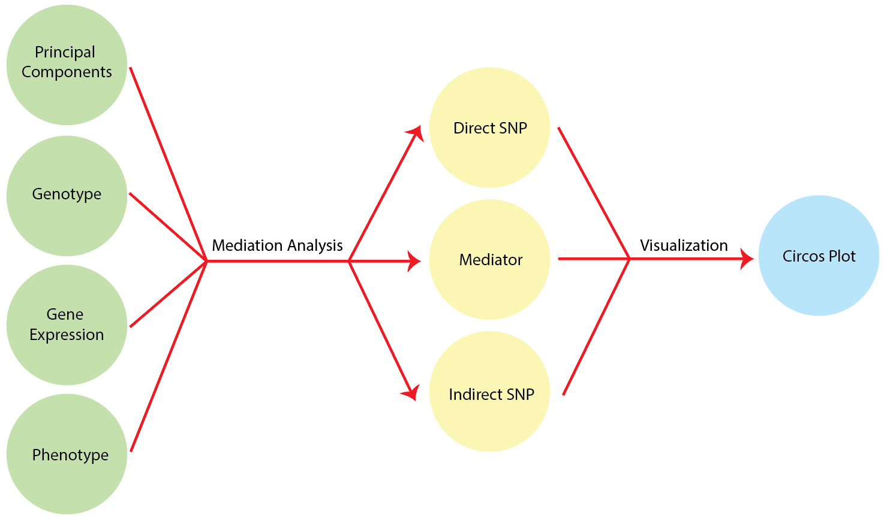

[](http://www.gnu.org/licenses/gpl-3.0)


## Overview of mediation analysis Workflow



## Installation

- __Running environment__: 
    - The workflow was constructed based on the __Linux system__ running the R v3.5.

- __Required software and versions__: 
    - [R 3.5](https://cran.r-project.org/)
        - /workflow/1_mediation_demo.R 
        - /lib/fromSKAT.R, highmed2019.r, MedWrapper.R, reporters.R, slurm_wrapper.R

## Input Data

The example data used here are simulated files.  

- `input/Z_matrix.txt` : Genotype (bi-allele SNP data, coded as -1, 0, 1, with each column represents each SNP, and each row represents each line)
- `input/X0_matrix.txt` : Confounder (Principal components of Z matrix, with each column represents each principal component, and each row represents each line)
- `input/X_matrix.txt` : Gene Expression (each column represents each gene expression, and each row represents each line)
- `input/y_matrix.txt` : Phenotype (each column represents each trait, and each row represents each line)


## Major steps

#### Step 1: running the 1_mediation_demo.R to conduct mediation analysis
- Note that you have to adjust the path at the begining in R script; and the path, ntasks, mem, time in the shell script.

```
sbatch workflow/1_mediation_demo.sh
```

#### Step 2: Visualization of outputs
- You can plot the results yourself using the below R code.
- Note that you have to adjust the path at the begining in R script;

```
2_circos_visual.R
```


## Expected results


## License
It is a free and open source software, licensed under []() (choose a license from the suggested list:  [GPLv3](https://github.com/github/choosealicense.com/blob/gh-pages/_licenses/gpl-3.0.txt), [MIT](https://github.com/github/choosealicense.com/blob/gh-pages/LICENSE.md), or [CC BY 4.0](https://github.com/github/choosealicense.com/blob/gh-pages/_licenses/cc-by-4.0.txt)).
